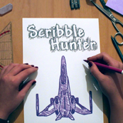

# ScribbleHunter 

ScribbleHunter is a scribble-style space shooter for Windows Phone and Windows 8 PC / Surface tablet.

    

Another day. Another boring lecture! Again, you scribble on your drawing pad and ... it happens again! Your sketches become real! So take the challenge again and become the ruler of your own universe!

You can get the app from the [Windows Store](http://www.windowsphone.com/s?appid=ed250596-e670-4d22-aee1-8ed0a08c411f).

### Features
- Challenging levels
- Smooth gameplay with 60 FPS
- Online leaderboards
- 9 power-ups
- Sensor calibration
- Techno sound by [PLSQMPRFKT](https://soundcloud.com/plsqmprfkt)

### Reviews

What did users think about this app? Here are just a few out of more than 150 reviews:

> "Schweres Spiel, aber gur gemacht. Übung macht den Meister. :D Grafik gut Steuerung auch, auf Lumia 820 läuft's super"
>
> _Thero, Germany_

> "Nice, lucid game play. Good interface. Fun game"
>
> _Pranjul, India_

## License

This work is published under [MIT][mit] License.

[mit]: https://github.com/b3nk4n/scribblehunter-game/blob/main/LICENSE
